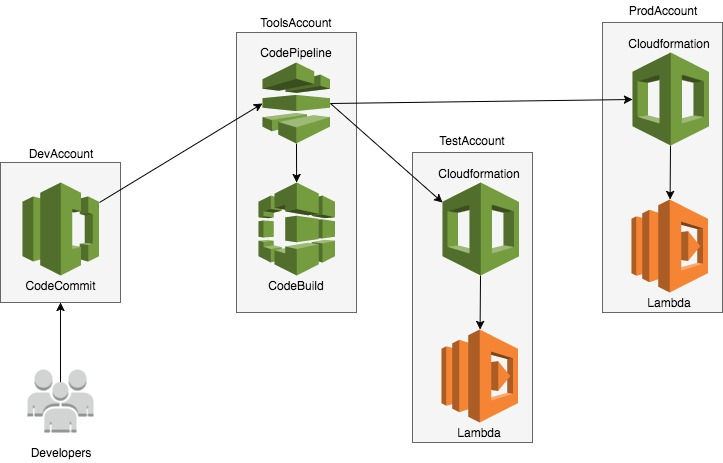

# Reference Architecture: Cross Account AWS CodePipeline

This reference architecture demonstrates how to push code hosted in [AWS CodeCommit](code-commit-url) repository in Development Account,
use [AWS CodeBuild](code-build-url) to do application build, store the output artifacts in S3Bucket and deploy these artifacts to Test
and Production Accounts using [AWS CloudFormation](clouformation-url). This orchestration of code movement from code checkin to deployment
is securely handled by [AWS CodePipeline](code-pipeline-url).


[][architecture]

## Running the example

#### 1. Clone the sample Lambda function GitHub repository

[Clone](https://help.github.com/articles/cloning-a-repository/) the [AWS LAMBDA sample application](https://github.com/awslabs/aws-pipeline-to-service-catalog.git) GitHub repository.

From your terminal application, execute the following command:

```console
git clone https://github.com/awslabs/aws-pipeline-to-service-catalog.git
```

This creates a directory named `aws-pipeline-to-service-catalog` in your current directory, which contains the code for the AWS Lambda function sample application.

#### 2. Create [AWS CodeCommit](code-commit-url) repository in Development Account

Follow the [instructions here](http://docs.aws.amazon.com/codecommit/latest/userguide/getting-started.html#getting-started-create-repo) to create a CodeCommit repository
in the Development Account.Name your repository as sample-lambda

Alternatively, from your terminal application, execute the following command. You may refer [here](http://docs.aws.amazon.com/codecommit/latest/userguide/how-to-create-repository.html#how-to-create-repository-cli)
on further details, in order to setup AWS Cli , if required.

```console
aws codecommit create-repository --repository-name sample-lambda --repository-description "Sample Lambda Function"
```

Note the cloneUrlHttp URL in the response from above CLI.

#### 3. Add a new remote

From your terminal application, execute the following command:

```console
git remote add AWSCodeCommit HTTP_CLONE_URL_FROM_STEP_2
```

Follow the instructions [here](http://docs.aws.amazon.com/codecommit/latest/userguide/setting-up.html) for local git setup required to push code to CodeCommit repository.

#### 4. Push the code AWS CodeCommit

From your terminal application, execute the following command:

```console
git push AWSCodeCommit master
```

[code-commit-url]: https://aws.amazon.com/devops/continuous-delivery/
[code-build-url]: https://aws.amazon.com/codebuild/
[code-pipeline-url]: https://aws.amazon.com/codepipeline/
[clouformation-url]: https://aws.amazon.com/cloudformation/
[lambda-url]: https://aws.amazon.com/lambda/
