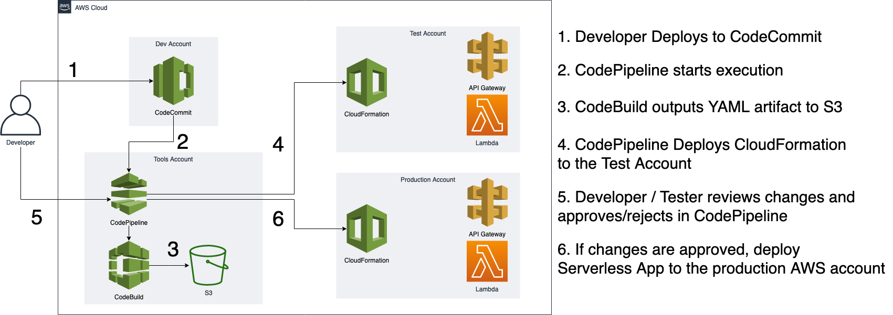

# Reference Architecture: Cross Account AWS CodePipeline

This reference architecture demonstrates how to push code hosted in [AWS CodeCommit](https://aws.amazon.com/codecommit/) repository in Development Account,
use [AWS CodeBuild](https://aws.amazon.com/codebuild/) to do application build, store the output artifacts in S3Bucket and deploy these artifacts to a Test AWS account, validate your deployment then approve the changes to be deployed to the Production Account using [AWS CloudFormation](https://aws.amazon.com/cloudformation/). This orchestration of code movement from code checkin to deployment is securely handled by [AWS CodePipeline](https://aws.amazon.com/codepipeline/).



> Notes from masmix
> Purpose of this for is focus on security approach from https://github.com/awslabs/aws-refarch-cross-account-pipeline
> It's mean that we focused on learn AWS services step by step using CLI with minimized usage AWS Console

## Running the example
> You need to create the CodeCommit repository (steps below) before making the pipeline infrastructure. 
> When creating the pipeline infrastructure, you can use the `single-click-cross-account-pipeline.sh` script or else follow the "Walkthrough" section of the [blog post](https://aws.amazon.com/blogs/devops/aws-building-a-secure-cross-account-continuous-delivery-pipeline/). 
#### Pre-requisites 
1. Install the [AWS CLI](https://docs.aws.amazon.com/cli/latest/userguide/cli-chap-install.html).
2. Intall the [SAM CLI](https://docs.aws.amazon.com/serverless-application-model/latest/developerguide/serverless-sam-cli-install.html).
3. Clone this repository.
4. Have the following AWS accounts (if using Control Tower, [this is useful](https://docs.aws.amazon.com/controltower/latest/userguide/account-factory.html#quick-account-provisioning)):
    * Tooling
    * Development
    * Test
    * Production
5. Create permissions for tools account (optional)

If you want to create IAM user and role only for this particular deployment please follow the instructions from Permissions-accounts-set-up/Tools/README.md
If your profile user has enough permissions, this step can be skipped. 

#### 1. Create a sample application using Serverless Application Model (SAM). 

We will create a sample serverless application locally, then commit the code to CodeCommit. From there, CodePipeline will build the serverless application, deploy it using CloudFormation to a test account then you will accept/reject the change from the pipeline.  If you accept the review in CodePipeline, the application will be deployed to production using CloudFormation. 

##### Create the sample application locally

From your terminal application/command line, execute the following command:

```console
sam init 
# Use the values: 
# - Template source:  Quick Start template
# - Runtime: Python 3.7
# - Project Name: sample-lambda
```

This creates a directory named `sample-lambda` in your current directory, which contains the code for a serverless application.

Navigate to the project folder and initialize the git client
```console
cd sample-lambda/
git init
```

#### 2. Create [AWS CodeCommit](code-commit-url) repository in Development Account
##### Console Method
Follow the [instructions here](http://docs.aws.amazon.com/codecommit/latest/userguide/getting-started.html#getting-started-create-repo) to create a CodeCommit repository in the Development Account. Name your repository as sample-lambda.

##### Terminal Method
From your terminal application, execute the following command. You may refer [here](http://docs.aws.amazon.com/codecommit/latest/userguide/how-to-create-repository.html#how-to-create-repository-cli) for further details on installing the AWS CLI if needed.

```console
aws codecommit create-repository --repository-name sample-lambda --repository-description "Sample Serverless App" --profile {{DEV-ACCOUNT-PROFILE}}
```

Note the cloneUrlHttp URL in the response from above CLI.

#### 3. Add a new remote

From your terminal application, execute the following command:

```console
git remote add AWSCodeCommit {{HTTP_CLONE_URL_FROM_STEP_2}}
```

Follow the instructions [here](http://docs.aws.amazon.com/codecommit/latest/userguide/setting-up.html) for local git setup required to push code to CodeCommit repository.

> Tip: The AWS CodeCommit Helper is useful to obtain Codecommit credentials using a profile, for example: 
>```console
>git config --global credential.helper '!aws --profile {{YOUR-PROFILE-HERE}} codecommit credential-helper $@'
>```

#### 4. Push the code AWS CodeCommit

From your terminal application, execute the following command:

```console
git add .
git commit -m "First push of my SAM app!"
git push AWSCodeCommit master
```

#### 5. See the pipeline in action.
Once you have your pipeline configured [as per the blog post](https://aws.amazon.com/blogs/devops/aws-building-a-secure-cross-account-continuous-delivery-pipeline/) across your tools, development, test and production AWS accounts, codepipeline will listen for new deployments to your 'sample-lambda' repository. You can configure the pipeline by following the walkthrough in the blog post or by running the `single-click-cross-account-pipeline.sh` script in this repo. Once it's spun up, push a change to the CodeCommit repo you just made then log in to your tools AWS account to ensure your codepipeline execution has kicked off. 

#### Next Steps
* If you want to deploy a different type of application, you will need to edit the buildspec file defined in the [`code-pipeline.yaml`](https://github.com/awslabs/aws-refarch-cross-account-pipeline/blob/master/ToolsAcct/code-pipeline.yaml) file.
    * You will also need to change the permissions of the roles deployed to the test/dev accounts depending on what type of resources you are deploying. This is in the [`toolsacct-codepipeline-cloudformation-deployer.yaml`](https://github.com/awslabs/aws-refarch-cross-account-pipeline/blob/master/TestAccount/toolsacct-codepipeline-cloudformation-deployer.yaml#L74) file which gets deployed to the Test & Prod accounts in step 3 of the [blog instructions](https://aws.amazon.com/blogs/devops/aws-building-a-secure-cross-account-continuous-delivery-pipeline/).

# Problems

## No default region


### Description

After run command 

```bash
single-click-cross-account-pipeline.sh
```
Error log:

You must specify a region. You can also configure your region by running "aws configure".

Solution: 

aws configure set region eu-west-1 --profile default 
aws configure set region eu-west-1 --profile ${tools_account_id}
aws configure set region eu-west-1 --profile ${dev_account_id}
aws configure set region eu-west-1 --profile ${test_account_id}
aws configure set region eu-west-1 --profile ${prod_account_id}

## Access Denied

Command:

```bash
single-click-cross-account-pipeline.sh
```

Error output:
An error occurred (AccessDenied) when calling the DescribeStacks operation: User: arn:aws:sts::374925447540:assumed-role/AWSReservedSSO_AWSOrganizationsFullAccess_ebce3644c0d9b654/przs@tlen.pl is not authorized to perform: cloudformation:DescribeStacks on resource: arn:aws:cloudformation:eu-west-1:374925447540:stack/pre-reqs/* because no identity-based policy allows the cloudformation:DescribeStacks action

Solution:
